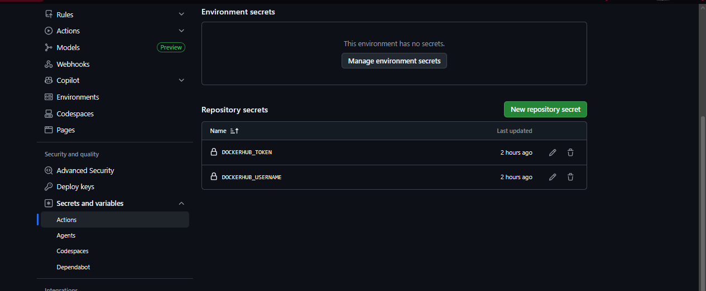
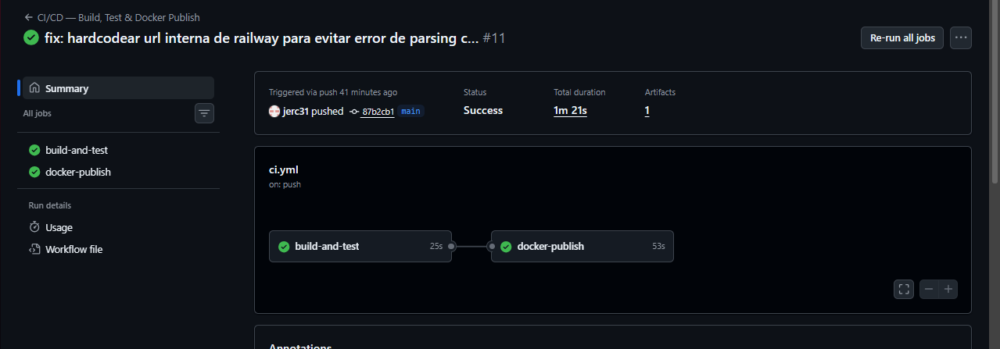
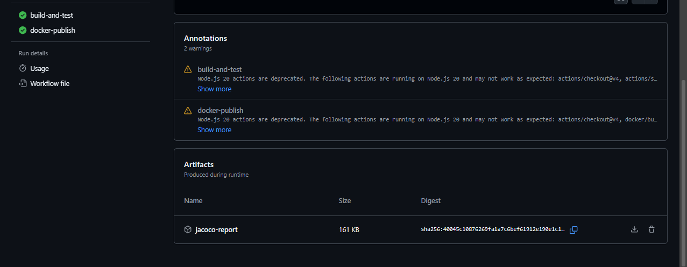
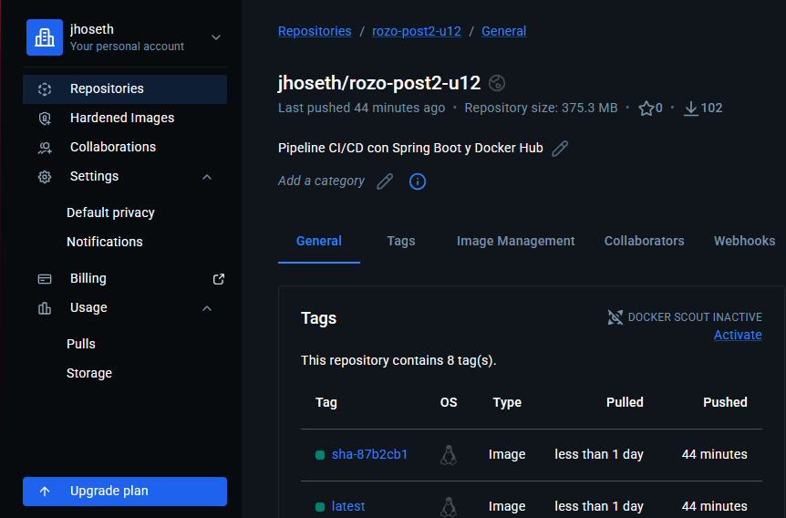

# Módulo de CI/CD Seguro en Spring Boot


## Autor

**Nombre:** Jhoseth Esneider Rozo Carrillo  
**Código:** 02230131027  
**Programa:** Ingeniería de Sistemas  
**Unidad:** Unidad 12 – Despliegue y CI/CD
**Actividad:** Post-Contenido 2
**Fecha:** 16/05/2026

---

## Descripción del Proyecto

Este proyecto implementa un pipeline de Integración Continua y Entrega Continua (CI/CD) avanzado en GitHub Actions, basándose en la contenedorización de la aplicación Spring Boot creada previamente.

Se integran mecanismos modernos como:

- **GitHub Actions** para automatizar el pipeline de CI/CD.
- **JaCoCo** para métricas y reporte de cobertura de pruebas unitarias.
- **Docker Hub** para publicación automática de imágenes multi-stage.
- **GitHub Secrets** para encriptar y gestionar credenciales de manera segura.

El objetivo es asegurar que la construcción, las pruebas y la publicación de imágenes en Docker Hub sucedan de forma completamente autónoma en cada cambio integrado a la rama principal, manteniendo altos estándares de calidad y seguridad.

---

## Objetivo

Implementar un sistema CI/CD que permita:

- Ejecutar pruebas unitarias de forma automática (CI).
- Generar e importar artefactos de cobertura con JaCoCo.
- Construir imágenes Docker multiplataforma sin interacción manual.
- Publicar la imagen generada en un registro público de forma segura (CD).

---

## Prerrequisitos

Antes de ejecutar el pipeline o el proyecto, asegúrate de tener:

- Una cuenta activa en **Docker Hub**.
- Git configurado localmente.
- Haber creado un **Access Token** de solo lectura/escritura en Docker Hub (Sección Security).
- Haber configurado los secretos en tu repositorio (`Settings -> Secrets and variables -> Actions`).

---

## Dependencias (CI/CD)

**Arquitectura del Pipeline**

```text
 post2/
   ├── .github/
   │   └── workflows/
   │       └── ci.yml
   ├── Dockerfile
   ├── docker-compose.yml
   ├── pom.xml (Con plugin de JaCoCo)
   └── src/
```

**Plugin de Cobertura en `pom.xml`:**

```xml
<plugin>
    <groupId>org.jacoco</groupId>
    <artifactId>jacoco-maven-plugin</artifactId>
    <version>0.8.11</version>
    <executions>
        <execution>
            <goals>
                <goal>prepare-agent</goal>
            </goals>
        </execution>
        <execution>
            <id>report</id>
            <phase>verify</phase>
            <goals>
                <goal>report</goal>
            </goals>
        </execution>
    </executions>
</plugin>
```

---

## Componentes de Seguridad y Despliegue CI/CD

### 1. GitHub Secrets

- **Decisión de diseño:**
  En lugar de colocar las contraseñas de Docker Hub en el código del YAML (práctica muy insegura), se guardan bajo las variables protegidas `DOCKERHUB_USERNAME` y `DOCKERHUB_TOKEN`. Así, nunca se exponen en texto plano.

### 2. JaCoCo Coverage Report

- **Decisión de diseño:**
  Se adjunta el reporte generado en `target/site/jacoco` como un artefacto descargable al terminar el Job de CI, lo que facilita auditar la calidad del software antes de generar la imagen.

### 3. Etiquetado Múltiple de Imagen (Tags)

- **Decisión de diseño:**
  La imagen no solo se sube como `latest`, sino que también se le asocia el SHA corto del commit (`sha-XXXXXXX`). Esto permite hacer rastreo exacto de la versión si existe un bug en producción.

---

## Ejecución del Proyecto

1. Clonar repositorio:

```bash
git clone https://github.com/jerc31/rozo-post2-u12.git
```

2. Ejecutar pruebas unitarias en local:

```bash
./mvnw clean verify
```

3. Descargar y ejecutar la imagen compilada por Actions:

```bash
docker pull jhoseth/rozo-post2-u12:latest
docker run -p 8080:8080 -e SPRING_PROFILES_ACTIVE=dev jhoseth/rozo-post2-u12:latest
```

---

## Checkpoints de CI/CD

✓ **Checkpoint 1: Configuración de Secrets**

- Acciones en GitHub: Verificación de secretos añadidos en el menú de Actions.

✓ **Checkpoint 2: Job de Pruebas (CI)**

- Evento: Push a main.
- Resultado: El runner de Ubuntu levanta el JDK 21, pasa los test unitarios y adjunta el `.zip` de cobertura JaCoCo.

✓ **Checkpoint 3: Publicación en Docker Hub (CD)**

- Condición: El paso anterior termina con éxito.
- Resultado: `docker-publish` sube la imagen y el repositorio en Docker Hub refleja las etiquetas (`latest` y `sha`).

---

## Flujo Completo de Seguridad y CI/CD

- El desarrollador integra nuevo código a la rama principal (`main`).
- GitHub Actions dispara el workflow.
- **Fase CI**: Se verifica la integridad del código, pasando test de JUnit y generando métricas.
- **Fase CD**: Se autentica de forma segura con Docker Hub.
- **Entrega**: Se lanza la nueva versión para que cualquier servidor o Railway la consuma.

---

## Capturas del Proyecto

Las siguientes capturas se encuentran en la carpeta `/evidencias/`

### GitHub Secrets Configuradas



### Workflow Actions Exitoso



### Reporte de JaCoCo Descargable



### Imagen Publicada en Docker Hub


